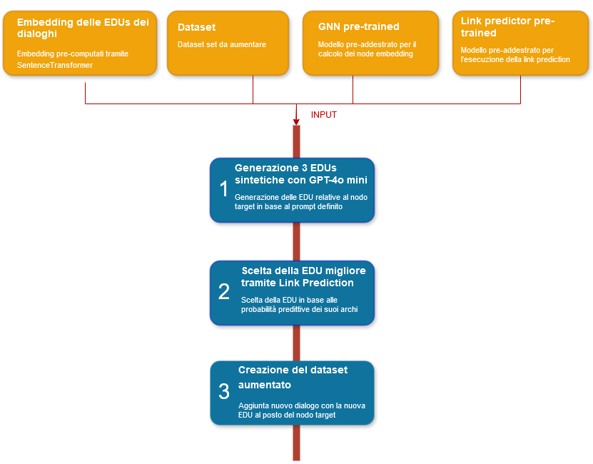

# Data Augmentation di strutture di dialoghi Multi-Party con Generazione Vincolata e Validazione GNN

Questo progetto si propone di sviluppare una pipeline per la Data Augmentation
di strutture di dialoghi multi-parte, sfruttando modelli di tipo Large Language Model
(LLM). Si vogliono generare nuovi dialoghi sintetici che rispettino rigorosamente 
i vincoli strutturali e semantici individuati sui dialoghi esistenti. La validazione dei 
dialoghi generati è implementata come un task di link prediction, eseguito tramite
Graph Neural Network (GNN). L'obiettivo è di verificare che, per ogni nuovo dialogo, le
relazioni tra unità del discorso (EDUs) siano preservate. I dialoghi che superano il processo
di validazione vengono inseriti nel dataset aumentato. Infine, il task di _Dialogue Discourse Parsing as Generation_
(vedi https://github.com/chuyuanli/Seq2Seq-DDP)
viene eseguito sul dataset di partenza e su quello aumentato, in modo da confrontare i risultati ottenuti
e verificare se l'augmentation ha determinato un miglioramento delle performance.


## Organizzazione del progetto
Di seguito è riportata una breve descrizione del contenuto delle diverse path del progetto.

`augemented_datasets`: contiene le versioni aumentate dei dataset;

`datasets`: contiene i dataset di partenza;

`embeddings`: contiene gli embedding prodotti dai SentenceTransformers ed utilizzati nella pipeline;

`graphic`: contiene le rappresentazioni grafiche di alcuni vincoli estratti dall'analisi dei dialoghi;

`info_rel`: contiene le informazioni sulle relazioni più frequenti per ciascun dataset;

`new_edus`: contiene le EDU generate tramite gli LLM;

`plot_loss`: contiene i grafici di plot della loss ottenuta nelle fasi di training e validazione;

`pretrain_model_GAT`: contiene i pesi delle Graph Attention Network (GAT) pre-addestrate sui rispettivi dataset;

`pretrain_model_GS`: contiene i pesi delle GraphSAGE (GS) pre-addestrate sui rispettivi dataset;

`scripts/constraints`: contiene gli script utilizzati per l'estrazione di vincoli sui dialoghi;

`scripts/GNN`: contiene gli script per il training, la validazione, il testing e l'utilizzo della GNN e del link predictor;

`scripts/LLM`: contiene gli script utilizzati per la generazione delle nuove EDU tramite gli LLM;

`scripts/SentenceTransformers`: contiene gli script utilizzati per la produzione degli embedding delle EDU;

`scripts/main.py`: contiene l'implementazione della pipeline e il codice per il suo utilizzo;

`DataAugmentation_report.pdf`: è la documentazione del progetto.


## Struttura della pipeline


La struttura della pipeline implementata è rappresentata nell'immagine. L'implementazione è indipendente
dal tipo di embedding, dal dataset da aumentare, nonché dalla GNN e dal link predictor addestrati per
l'effettuazione delle predizioni.

- I nostri script per la costruzione degli embedding sono in `scripts/SentenceTransformers`.
- I dataset che abbiamo usato sono in `datasets`.
- I nostri script per la costruzione e il training di GAT e GS sono in `scripts/GNN`.
- I nostri script per la costruzione e il training del link predictor sono in `scripts/GNN`.

Nota: per sostituire le nostre implementazioni di GNN con una nuova implementazione, è essenziale che la classe
implementata esponga un metodo `predict`, avente esattamente la firma dei metodi forniti dalle nostre implementazioni.


## Requisiti
L'esecuzione del progetto richiede l'installazione delle dipendenze, da eseguirsi tramite il comando
```
    pip install requirements.txt
```


## Autori e contatti
| Autore              | Indirizzo email                |
|---------------------|--------------------------------|
| Simona Lo Conte     | s.loconte2@studenti.unisa.it   |
| Marta Napolillo     | m.napolillo1@studenti.unisa.it |
| Francesco Giorgione | f.giorgione4@studenti.unisa.it |

